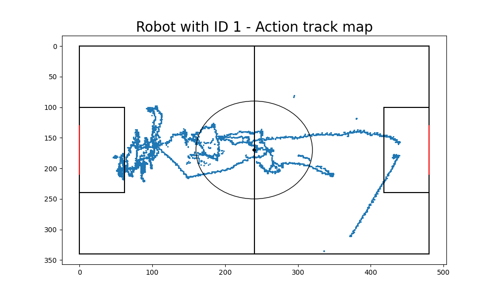

# ViSta


## Easy of use app for Robocup games analysis and stats

This desktop app allows you to explore a robocup match through some of most important analysis and stats.


Here its features and analysis:

- HEATMAP, for visualizing a chosen robot or ball heatmap 

- TRACKMAP, for visualizing a chosen robot or ball trackmap

- PASS-SHOT MAP, for visualizing passes, shot and goal global map

- CALCULATE STATS, for visualizing every stats of each team, similar to soccer end match stats

Before starting the app you should have installed python with libraries tkinter, PIL, matplotlib, pandas, numpy, math and statistics, often already included in python package (you can also use virtual environement such as anaconda)

if the libraries are not present you have to install them. 
- If you use anaconda create a new environment or add this libraries on the main environment you are using
- If you don't use anaconda you can install them with pip module by typing in terminal
```python
pip install -r requirements.txt
```
In order to start the app, open the terminal on the main folder guiRobocup and type :

```python
python3 ViSta.py

#or

python ViSta.py
```

note: App launch may take some time (even more than a minute) due to statistical operations on the dataset performed before starting the GUI


## Developers
- [Unibas Wolves](https://sites.google.com/unibas.it/wolves), robotics and computer vision team from Università degli studi della Basilicata

## Theme used
- [Azure ttk theme](https://github.com/rdbende/Azure-ttk-theme) by rdbende

